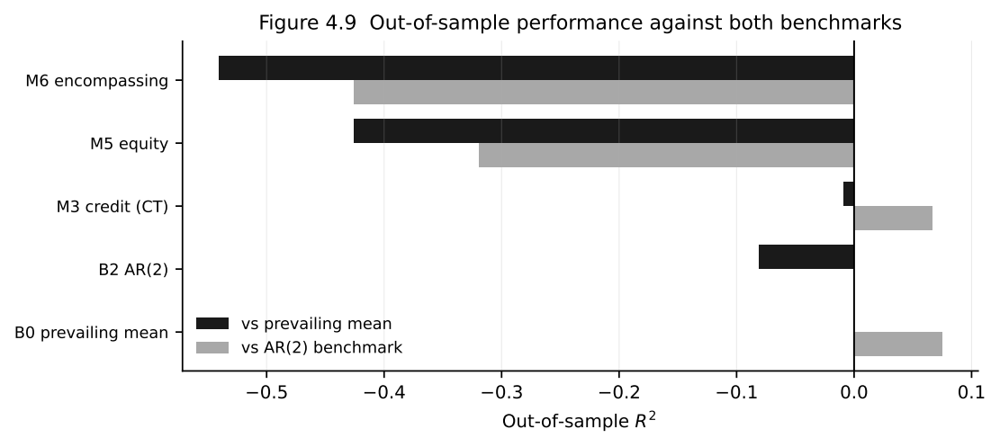
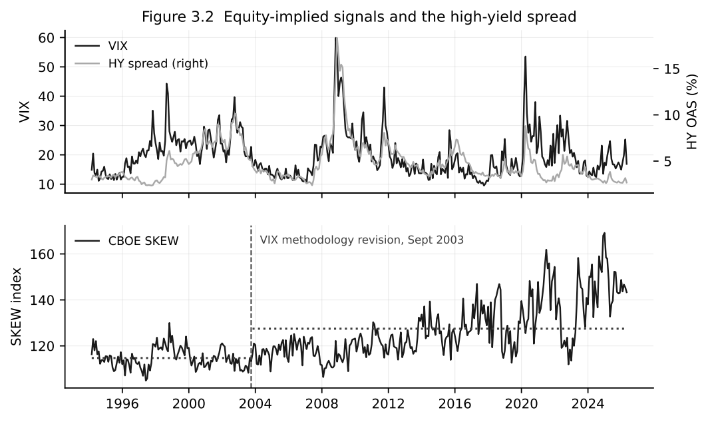
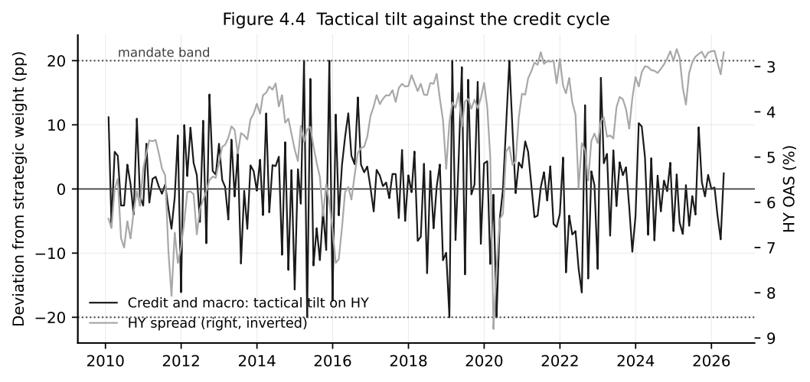

# Equity-Implied Signals in Corporate Bond Allocation

> **Reproduction note.** Licensed input data are intentionally excluded. The analysis code, input specification and selected derived results are provided.

Can information embedded in equity markets improve tactical allocation between high-yield and investment-grade corporate bonds?

This project tests that question using a deliberately demanding research design: predictive regressions, recursive out-of-sample forecasts, portfolio implementation, benchmark comparisons, robustness checks, block bootstrap inference and a Superior Predictive Ability test.

The central finding is cautionary. Equity-implied variables display economically plausible relationships in parts of the sample, but they do not deliver reliable out-of-sample forecasting gains over simple benchmarks. Credit-market information is more durable, although the evidence is not strong enough to establish broad strategy superiority after multiple-model testing.



## Research question

Equity volatility, option-implied skew and the variance risk premium are often treated as forward-looking measures of risk appetite and tail risk. If those measures contain information relevant to corporate credit, they may help an investor vary exposure between high-yield and investment-grade bonds.

The empirical question is not whether these signals explain historical outcomes. It is whether they improve forecasts and portfolio decisions using only information that would have been available at the time.

## Empirical design

- Monthly sample: February 1994 to April 2026
- Recursive out-of-sample evaluation beginning in January 2010
- Corporate-bond outcomes: high-yield versus investment-grade spread and return measures
- Equity information: VIX, CBOE SKEW and the variance risk premium
- Credit information: option-adjusted spreads, spread changes and alternative credit measures
- Benchmarks: recursively estimated prevailing mean (B0), AR(1) (B1), AR(2) (B2) and static portfolio allocations
- Portfolio evaluation: return, volatility, Sharpe and Sortino ratios, drawdown, turnover, certainty equivalents and information ratios
- Validation: alternative specifications, subsamples, bootstrap inference and Hansen's Superior Predictive Ability framework

## Main findings

| Finding | Interpretation |
|---|---|
| The equity-information model produces negative out-of-sample R-squared against both principal benchmarks. | In-sample intuition does not translate into dependable forecasting performance. |
| The credit model improves on the AR(2) benchmark in the central spread specification, but not on the prevailing-mean benchmark. | Credit information is more promising, but the result depends on the comparison being used. |
| Tactical strategies can show higher raw Sharpe ratios than the static 50/50 allocation. | Portfolio metrics alone can make weak forecasts look persuasive, particularly before considering turnover and model-selection uncertainty. |
| SPA p-values are 0.274 for the full strategy set and 0.128 for the credit subset. | The analysis does not reject the null that the benchmark is at least as good as the competing strategies. |





## Why the negative result matters

Financial signals can look persuasive because they have an intuitive story, significant coefficients in selected specifications or attractive backtested portfolio statistics. A useful model must survive recursive forecasting, realistic benchmarks, subsample analysis and data-snooping controls.

This project therefore treats failure to beat a simple benchmark as a substantive result rather than something to hide. The evidence supports a more conservative conclusion: credit-market variables contain some incremental information, while the tested equity-implied signals do not provide a stable standalone timing advantage.

## Repository structure

```text
.
├── thesis_mujtaba_final.py   # Complete empirical pipeline
├── requirements.txt          # Reproducible Python environment
├── data/
│   └── README.md             # Input schema and data-access note
└── results/
    ├── figures/              # Selected publication figures (PDF and PNG)
    └── tables/               # Selected result tables
```

## Reproducing the analysis

1. Create a Python 3.12 environment.
2. Install the required packages:

   ```bash
   python -m pip install -r requirements.txt
   ```

3. Obtain the required inputs described in [`data/README.md`](data/README.md).
4. Place `monthly_signals.csv`, `daily_signals.csv` and `french_daily.csv` beside the analysis script.
5. Run:

   ```bash
   python thesis_mujtaba_final.py
   ```

The pipeline writes 37 CSV tables and 11 figures in both PDF and PNG formats to `results/`.

## Data availability

The cleaned research inputs include variables derived from licensed Bloomberg data. Those observations are not redistributed here. Publicly available components include the Fama–French factors and selected macro-financial series, subject to their respective source terms.

The repository provides the complete analysis code, selected derived results and an input specification so that an authorised user can reconstruct the dataset using properly licensed sources.

## Context

Individual master's thesis research completed at Frankfurt School of Finance & Management, 2026.

## Author

Mujtaba Ali Bhutto

## Disclaimer

This repository documents academic financial research. It is not investment advice, a trading recommendation or a production investment model. Historical and simulated results do not guarantee future performance.
